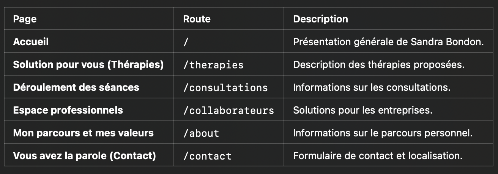

# Sandra Bondon - Psychopraticienne

Site web informatif pour Sandra Bondon, psychopraticienne spécialisée dans la gestion des émotions, des traumatismes et des phobies grâce à des méthodes comme la **MOSAÏC®**, l'**hypnose thérapeutique**, et la **PNL**.

Ce projet est développé avec **Next.js** et **Tailwind CSS** et déployé sur **Vercel**.

---

## 🚀 Fonctionnalités :

- **Présentation des services** : Thérapies personnalisées pour adultes et enfants.  
- **Formulaire de contact** : Permet aux visiteurs de prendre rendez-vous facilement.  
- **Avis Google** : Intégration d’une API pour afficher des avis clients.  
- **Carte interactive** : Localisation et itinéraire via Google Maps.  

---

## 🛠️ Technologies utilisées :

- **Next.js (Pages Router)** : Framework React pour le développement web moderne.  
- **Tailwind CSS** : Framework CSS utilitaire pour des mises en page rapides et réactives.  
- **Vercel** : Plateforme pour hébergement et déploiement continu.  

---

## 📦 Installation locale :

1. **Clonez ce dépôt** :
   ```bash
   git clone <URL-du-repo>
2. **Installer les dépendances** :
   ```bash
   npm install
3. **Lancer le serveur local** :
   ```bash
   npm run dev
4. **Ouvrez votre navigateur** :
   sur http://localhost:3000

---

## 🌍 Déploiement sur Vercel :
Le site est déployé automatiquement sur Vercel à chaque mise à jour de la branche main.

---

## 📖 Pages et routes :


---

## 🔧 Maintenance et mises à jour :
Mises à jour gérées via GitHub avec des branches spécifiques pour chaque fonctionnalité.
Fusion dans dev pour les tests avant déploiement sur main.

---

## ✨ Contribuer :
Les contributions sont bienvenues ! Clonez le dépôt, créez une branche, développez et soumettez une pull request. 😊

---

## 📄 Licence :
Ce projet est sous licence MIT. Consultez le fichier [LICENSE](./LICENSE) pour plus d’informations.